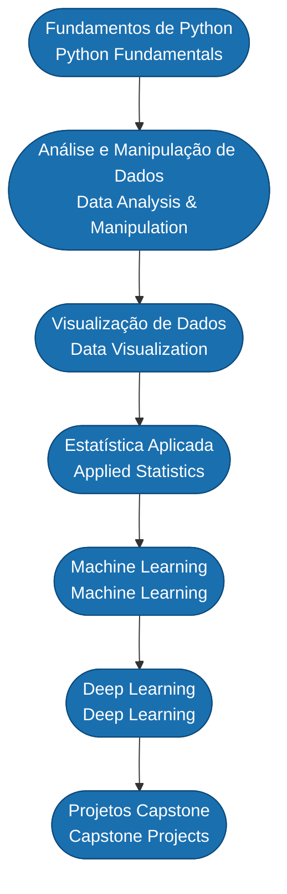

<div align="center">

# EBAC — Escola Britânica de Artes Criativas e Tecnologia

### Curso: Cientista de Dados

[](https://python.org)
[](https://pandas.pydata.org)
[](https://numpy.org)
[](https://scikit-learn.org)
[](./LICENSE)

**[PT-BR](#-sobre-este-repositório) | [English](#-about-this-repository)**

</div>

---

## Sobre este Repositório

Este é o repositório central do meu percurso no curso de **Cientista de Dados** da [EBAC (Escola Britânica de Artes Criativas e Tecnologia)](https://ebaconline.com.br). Aqui consolidei os módulos, exercícios, projetos e aprendizados ao longo de toda a formação — do Python básico até modelos de Machine Learning e Deep Learning aplicados a problemas reais.

O curso da EBAC é uma das formações mais completas em Ciência de Dados disponíveis no Brasil, cobrindo desde fundamentos de programação até técnicas avançadas de modelagem preditiva, com foco prático e orientação para o mercado de trabalho.

---

## About This Repository

This is the central repository for my journey through the **Data Scientist** program at [EBAC (British School of Creative Arts and Technology)](https://ebaconline.com.br). It consolidates modules, exercises, projects, and learnings throughout the entire program — from Python basics to Machine Learning and Deep Learning models applied to real-world problems.

---

## Trilha de Aprendizado / Learning Path



---

## Estrutura do Curso / Course Structure

| Módulo / Module | Conteúdo / Content | Tecnologias / Technologies |
|---|---|---|
| Fundamentos de Python | Variáveis, estruturas de dados, funções, POO | Python |
| Análise de Dados | Manipulação e limpeza de dados tabulares | Pandas, NumPy |
| Visualização | Gráficos exploratórios e dashboards | Matplotlib, Seaborn, Plotly |
| Estatística | Probabilidade, testes de hipótese, distribuições | SciPy, Statsmodels |
| Machine Learning | Regressão, classificação, clustering, avaliação de modelos | Scikit-learn |
| Deep Learning | Redes neurais, CNNs, RNNs | TensorFlow, Keras |
| Projetos Capstone | Projetos integradores com dados reais | Stack completa |

---

## Projetos em Destaque / Featured Projects

Abaixo estão os projetos desenvolvidos como parte dos módulos práticos do curso:

### EBAC-PROJETO-CIENTISTA-DE-DADOS-M14
Projeto do Módulo 14 focado em aplicações práticas de Machine Learning com dados reais, incluindo pipeline de preparação de dados, seleção de features e avaliação de modelos preditivos.

**Repositório:** [galafis/EBAC-PROJETO-CIENTISTA-DE-DADOS-M14](https://github.com/galafis/EBAC-PROJETO-CIENTISTA-DE-DADOS-M14)

---

### EBAC-PROJETO-CIENTISTA-DE-DADOS-M15
Projeto do Módulo 15 com foco em técnicas avançadas de modelagem, otimização de hiperparâmetros e interpretabilidade de modelos aplicados a conjuntos de dados do mundo real.

**Repositório:** [galafis/EBAC-PROJETO-CIENTISTA-DE-DADOS-M15](https://github.com/galafis/EBAC-PROJETO-CIENTISTA-DE-DADOS-M15)

---

## Tecnologias Utilizadas / Technologies Used

```
Linguagem principal:   Python 3.x
Análise de dados:      Pandas · NumPy · SciPy
Visualização:          Matplotlib · Seaborn · Plotly
Machine Learning:      Scikit-learn
Deep Learning:         TensorFlow · Keras
Ambiente:              Jupyter Notebook · Google Colab
Versionamento:         Git · GitHub
```

---

## Como Navegar / How to Navigate

Cada pasta dentro deste repositório corresponde a um módulo ou tema do curso. Os notebooks estão numerados e comentados para facilitar o acompanhamento sequencial.

```
EBAC/
├── modulo-01-python-basico/
├── modulo-02-pandas-numpy/
├── modulo-03-visualizacao/
├── modulo-04-estatistica/
├── modulo-05-machine-learning/
├── modulo-06-deep-learning/
├── projetos/
│   ├── M14/
│   └── M15/
├── LICENSE
└── README.md
```

---

## Contato / Contact

<div align="center">

**Gabriel Demetrios Lafis**
Cientista de Dados | Data Scientist

[](https://github.com/galafis)
[](mailto:gabrieldemetrios@gmail.com)

</div>

---

## Licença / License

Distribuído sob a licença MIT. Veja o arquivo [LICENSE](./LICENSE) para mais detalhes.

Distributed under the MIT License. See [LICENSE](./LICENSE) for more information.

---

<div align="center">

*Formação em Ciência de Dados — EBAC, Brasil*

</div>
